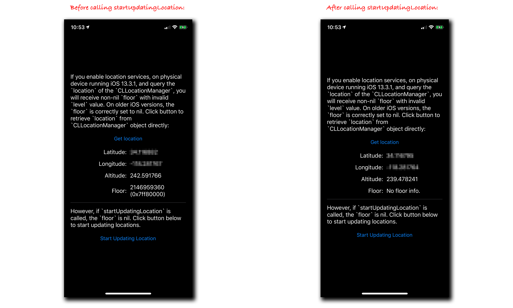

#  CLFloor Bug

This is a demonstration of a problem that manifests itself on iOS 13.3.1 physical device if you query the `location` of the `CLLocationManager` without having first called `startUpdatingLocation`. 

* Run this app on physical device running iOS 13.3.1 in a location for which there is no `CLFloor` data (e.g. a private residence);
* Press the “Get Location” button; and 
* You will receive non-nil `floor` object, and its `level` will contain a value of `0x7ff80000`. The `floor` should be `nil`. 

I was unable to manifest this behavior on old iOS device (iPhone 6 running iOS 10) nor on simulators regardless of iOS version.

If, however, you tap on the “Start Updating Location” button, you'll see location updates start to come in and the `floor` will correctly be `nil`.

The salient code is in the [`ViewController`](CLFloorBug/ViewController.swift).

On the left, this is what my screen reported after tapping on “Get Location”. On the right, this is what my screen reported after tapping on “Start Updating Location”. The reported `latitude` and `longitude` were correct, but I've simply obscured them in the screen snapshots below for the sake a privacy: 

---

This was developed using Xcode 11.3.1 (11C504).

---

March 24, 2020

Copyright (c) 2020 Rob Ryan. All Rights Reserved.

See [License](LICENSE.md).
